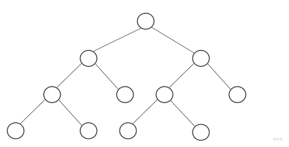
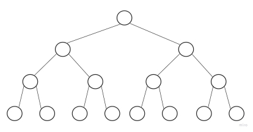

<h1>Árvores</h1>

---

<h2>Índice</h2>

- [Árvore](#árvore)
  - [Definições básicas](#definições-básicas)
  - [Árvore binária](#árvore-binária)
  - [Árvore AVL](#árvore-avl)
    - [Balanceamento](#balanceamento)
      - [Rotação à esquerda:](#rotação-à-esquerda)
      - [Rotação à direita:](#rotação-à-direita)
      - [Rotação dupla à esquerda:](#rotação-dupla-à-esquerda)
      - [Rotação dupla à direita:](#rotação-dupla-à-direita)
      - [Como decidir as rotações:](#como-decidir-as-rotações)
    - [Complexidade](#complexidade)
  - [Árvore Rubro-Negra](#árvore-rubro-negra)
    - [História](#história)
    - [Definição](#definição)
    - [Implementação](#implementação)
    - [Complexidade](#complexidade-1)
    - [Aplicações](#aplicações)

---

## Árvore

Uma árvore é uma [estrutura de dados](## "Uma estrutura de dados é uma coleção tanto de valores (e seus relacionamentos) quanto de operações (sobre os valores e estruturas decorrentes).") com um valor raiz e subárvores filhas com um nó pai.

Uma árvore pode ser definida recursivamente como uma coleção de nós, onde cada nó é uma estrutura de dados que consiste em um valor e uma lista de referências a nós.

<center>


</center>

### Definições básicas

**Árvore (Grafo)**: Um grafo conexo acíclico.

**Raiz**: O início da árvore é o "nó raiz". O que está no topo da árvore e pode dar origem a todos os outros nós.

**Nó folha (externo)**: Nó não-raiz que não possui nenhum outro filho (grau 0).

**Profundidade de um nó**: é a distância deste nó até a raiz.

**Nível**: Um conjunto de nós com a mesma profundidade é denominado **nível** da árvore. Sendo 0 o nível da raiz.

**Altura de uma árvore**: O maior dos níveis de seus nós externos (folhas) + 1. Ex.: Na árvore da imagem acima é 4. Isto é, o maior nível + 1.

**Árvore balanceada**: Uma árvore é considerada balanceada se, para qualquer nó, a altura de suas duas subárvores diferem de, no máximo, uma unidade.

---

### Árvore binária

Uma árvore binária é uma árvore caracterizada por:

- Ou não tem elemento algum (árvore vazia).
- Ou tem um elemento distinto, denominado raiz, com dois ponteiros para duas estruturas diferentes, denominadas subárvore esquerda e subárvore direita.

Os nós de uma árvore binária possuem graus zero, um ou dois. Um nó de grau zero é denominado folha.

> Em uma árvore binária, por definição, cada nó poderá ter **no máximo duas folhas**:

<center>


</center>

> Uma árvore **estritamente binária**, ou **quase completa**, é uma árvore na qual todo nó tem zero ou duas folhas:

<center>



</center>

> Uma árvore binária **completa** é uma árvore em que todos os níveis têm o máximo número de elementos:

<center>



</center>

---

### Árvore AVL

O nome AVL vem de seus criadores soviéticos Adelson Velsky e Landis.

Uma árvore AVL é uma árvore sempre balanceada. Isto é, as alturas das subárvores esquerda e direita de cada nó diferem no máximo por uma unidade.

Para isto ser possível, suas operações de inserção e exclusão são realizadas com rotinas de balanceamento.

#### Balanceamento

Para a árvore AVL se manter sempre balanceada, quando uma inserção ou deleção é realizada, a àrvore realiza uma operação de rotação para manter o equilíbro da árvore.

O equilíbrio da árvore é decidido a partir do **fator de balanceamento** da mesma.

**Fator de balanceamento (equilíbrio) de um nó**: É a altura da sub-árvore da esquerda h<sub>e</sub> subtraída da sub-árvore da direita h<sub>d</sub>. Ou seja: $ Q = h_d - h_e $.

Uma árvore equilibrada deve ter o fator de balanceamento entre -1 e 1. Ou seja, $ Q \in [-1, 1] $.

Caso a árvore esteja desequilibrada, o seguinte algoritmo deve ser seguido para corrigir o desequilíbrio:

##### Rotação à esquerda:

Dados os nós 1, 2, 3, onde:

```
raiz = 1;
1.direita = 2;
2.direita = 3;
```

Uma rotação à esquerda desta árvore é:

```
2.esquerda = 1;
raiz = 2;
1.direita = nulo;
```

Caso 2 possua um filho esquerdo, por exemplo `x`, a rotação ficaria:

```
2.esquerda = 1;
raiz = 2;
1.direita = x;
```

##### Rotação à direita:

Seja a árvore a,b,c,d, onde:

```
raiz = c;
c.esquerda = b;
b.esquerda = a;
b.direita = d;
```

Uma rotação à direita é:

```
b.direita = c;
raiz = b;
c.esquerda = d;
```

##### Rotação dupla à esquerda:

Algumas vezes as rotações simples não ajustam o desequilíbrio da raiz, então uma rotação dupla é necessária. Suponha a árvore a,b,c da seguinte forma;

```
raiz = a;
a.direita = c;
c.esquerda = b;
```

Uma rotação dupla à esquerda é:

```
# Rotação à direita na sub-árvore da direita:
a.direita = b;
b.direita = c;
# Rotação à esquerda na árvore original:
b.esquerda = a;
raiz = b;
a.direita = nulo;
```

##### Rotação dupla à direita:

Suponha a árvore a,b,c da seguinte forma;

```
raiz = c;
c.esquerda = a;
a.direita = b;
```

Uma rotação dupla à direita é:

```
# Rotação à esquerda na sub-árvore da direita:
c.esquerda = b;
b.esquerda = a;
# Rotação à direita na árvore original:
b.direita = c;
raiz = b;
c.esquerda = nulo;
```

##### Como decidir as rotações:

Siga o seguinte algoritmo:

```
funcao calcular_equilibrio(no) {
  h_d = altura(no.direita);
  h_e = altura(no.esquerda);
  retorna h_d - h_e;;
}

funcao balancear(raiz) {
  Q = calcular_equilibrio(raiz);

  # Árvore equilibrada
  se (Q >= -1 e Q <= 1)
    retorna;

  # Árvore desequilibrada
  senão
    se (q > 1) {
      se (calcular_equilibrio(raiz.direita) < 0)
        rotacao_dupla_esquerda(raiz);
      senão
        rotacao_esquerda(raiz);
    }
    senão {
      se (calcular_equilibrio(raiz.esquerda) < 0)
        rotacao_dupla_direita(raiz);
      senão
        rotacao_direita(raiz);
    }
}

```

#### Complexidade

A árvore AVL tem complexidade O(log *n*) para todas operações e ocupa espaço n, onde n é o número de nós da árvore.

---

### Árvore Rubro-Negra

#### História

Em 1972, Rudolf Bayer inventou uma estrutura de dados que era um caso especial de ordem 4 de uma árvore B. Essas árvores mantinham todos os caminhos da raiz à folha com o mesmo número de nós, criando árvores perfeitamente equilibradas. No entanto, eles não eram árvores de busca binárias. A Bayer os chamou de "árvore B binária simétrica". Então, em um artigo de 1978, "A Dichromatic Framework for Balanced Trees", Leonidas J. Guibas e Robert Sedgewick derivaram a árvore vermelho-preta da árvore B binária simétrica. A cor "vermelho" foi escolhida porque era a cor mais bonita produzida pela impressora a laser colorida disponível para os autores enquanto trabalhavam na Xerox PARC. Outra resposta de Guibas afirma que foi por causa das canetas vermelhas e pretas de que dispunham para desenhar as árvores.

#### Definição

> Uma árvore rubro-negra é um tipo de árvore binária de busca auto-balanceável que adere um conjunto estrito de regras para manter uma complexidade temporal logarítmica.

No nível mais básico, as árvores vermelho-preta devem seguir 4 regras para poder manter suas propriedades:

1. Cada nó deve ser vermelho ou preto.

2. A raiz é sempre preta.

3. Dois nós vermelhos nunca aparecem consecutivamente. Isto é, um nó vermelho sempre deve ter um nó-pai preto.

4. Todos os caminhos do nó raiz até uma folha devem passar pelo exato mesmo número de nós pretos.

Geralmente também é considerada uma quinta regra adicional:

5. Todos os nós folhas são pretos.

#### Implementação

Uma árvore rubro-negra pode ser representada por uma árvore de busca binária auto-balanceável onde cada nó possui um bit extra que é interpretado como a cor do nó (vermelho ou preto).

É de demonstração conhecida que não se faz possível uma cadeia (sequência) de 3 nós para um lado apenas em uma árvore rubro-negra. A partir disso, podemos derivar operações que garantem o balanceamento da árvore.

#### Complexidade

A complexidade temporal de pior caso de uma árvore rubro-negra, para quaisquer operações (busca, inserção, deleção, máximo, mínimo...), é **O(log n)**.

#### Aplicações

1. A maioria das funções da biblioteca BST de auto-equilíbrio, como map e set em C++ (OR TreeSet e TreeMap em Java), usam Red-Black Tree.
2. A implementação do [Completely Fair Scheduler](https://en.wikipedia.org/wiki/Completely_Fair_Scheduler) (escalonador de processos do Linux) utiliza a Red-Black Tree como estrutura de dados para gerenciar as prioridades dos processos.
3. MySQL usa árvores Red-Black para armazenar os índices em tabelas.
4. São também utilizadas nos algoritmos de clusterização por k-means.

---
